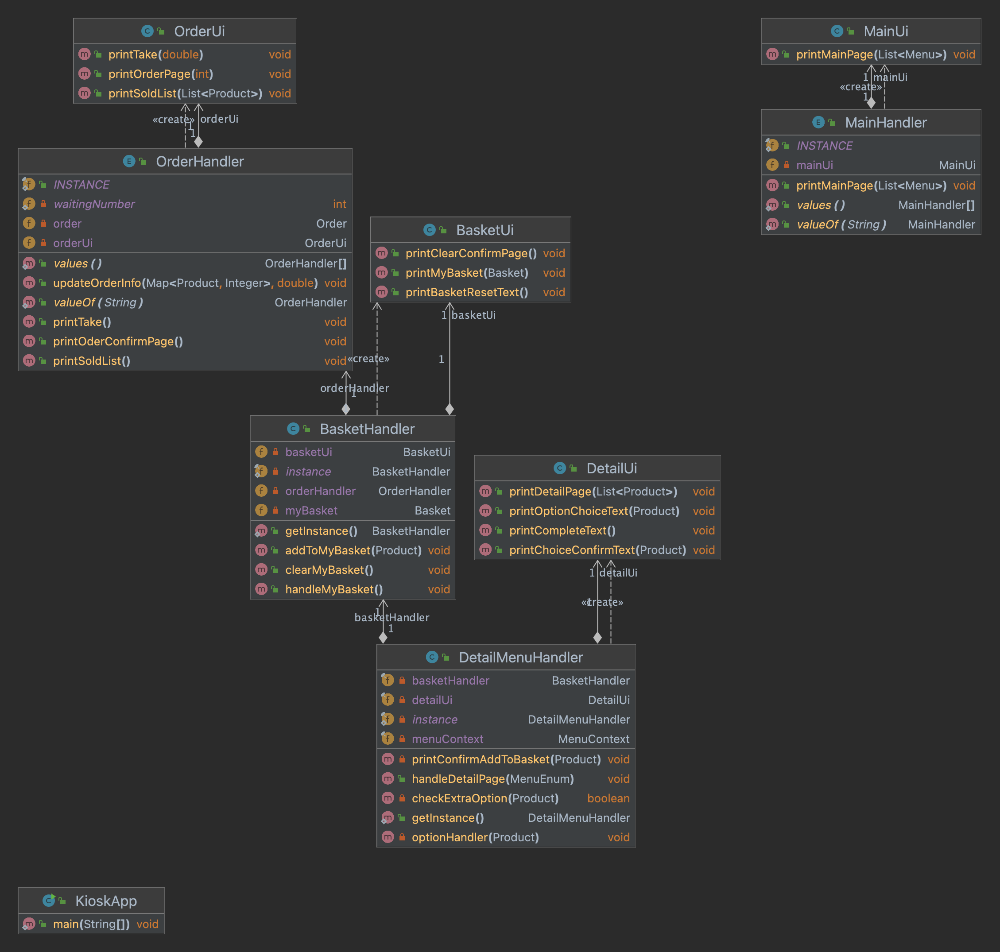

# kiosk

## 개요
스파르타 코딩클럽 내일배움캠프 스프링 3기 자바 개인과제 프로젝트
자바 CLI 키오스크 프로그램.

## 개발 기간
2023.10.28 ~ 29

## 사용언어
JAVA

## 요구사항
https://teamsparta.notion.site/Java-b540d0878ee14ad0a84a425a0904182d
## 기능

 메인 화면에서 버거, 음료 등의 카테고리를 고른다.<br>
선택한 메뉴 카테고리에 맞는 상품들이 나온다. 상품을 고르면 어떤 옵션으로 고를 것인지 선택할 수 있다.<br>
선택한 상품은 장바구니에 추가하거나 다시 고를 수 있다. 진행중인 주문을 취소하고 싶다면 메인에서 주문 취소를 할 수도 있고 다 고른 뒤 메인의 장바구니 보기를 선택하여 주문할 수 있다. 프로그램 종료도 가능하다.<br> 메인에서 히든 메뉴로 0번을 누르면 현재까지 판매된 상품과 수익을 확인할 수 있다.<br>

## 스크린샷
## 다이어그램

### 메인화면
```
--------------------------------------------
SHAKESHACK BURGER 에 오신걸 환영합니다.
아래 메뉴판을 보시고 메뉴를 골라 입력해주세요. 

[ SHAKESHACK BURGER MENU ]

1. BURGER    | 앵거스 비프 통살을 다져만든 버거
2. ICE CREAM | 매장에서 신선하게 만드는 아이스크림
3. DRINKS    | 매장에서 직접 만드는 음료
4. BEER      | 뉴욕 브루클린 브루어리에서 양조한 맥주

[ ORDER MENU ]
5.장바구니 보기
6.주문 초기화
9.프로그램 종료
--------------------------------------------
```
### 상품 상세화면
```
SHAKESHACK BURGER 에 오신걸 환영합니다.

아래 상품메뉴판을 보시고 상품을 골라 입력해주세요

[ BURGER MENU ]
1. ShackBurger       | W 6.9 | 토마토, 양상추, 쉑소스가 토핑된 치즈버거
2. SmokeShack        | W 8.9 | 베이컨, 체리 페퍼에 쉑소스가 토핑된 치즈버거
3. Shroom Burger     | W 9.4 | 몬스터 치즈와 체다 치즈로 속을 채운 베지테리안 버거
4. Cheeseburger      | W 6.9 | 포테이토 번과 비프패티, 치즈가 토핑된 치즈버거

1
ShackBurger       | W 6.9 | 토마토, 양상추, 쉑소스가 토핑된 치즈버거위 메뉴의 어떤 옵션으로 추가하시겠습니까?
1. Single(₩ 6.9)      2. Set(₩ 8.0)      
1
ShackBurger       | W 6.9 | 토마토, 양상추, 쉑소스가 토핑된 치즈버거
위 메뉴를 장바구니에 추가하시겠습니까?

1. 확인        2. 취소
1
장바구니에 담겼습니다.
```
### 장바구니 화면

```
--------------------------------------------
지금과 같이 주문하시겠습니까?

[ ORDERS ]
ShackBurger    | W 6.9 | 1개 | 토마토, 양상추, 쉑소스가 토핑된 치즈버거

[ Total ]
W 6.9

1. 주문      2. 메뉴판
--------------------------------------------
```

### 주문 완료 화면
```
주문이 완료되었습니다!

대기번호는 [ 1 ] 번 입니다.(3초후 메뉴판으로 돌아갑니다.)
```

### 주문 초기화 화면
```
--------------------------------------------
6
진행하던 주문을 취소하시겠습니까?

1. 확인        2. 취소
1
주문이 초기화되었습니다.
--------------------------------------------
```
### 판매된 상품 조회
```
[ 총 판매상품 목록 현황 ]

현재까지 판매된 상품이 없습니다.

1. 돌아가기
```

### 총 판매금액 조회
```
[ 총 판매금액 현황 ]
현재까지 총 판매된 금액은 [ W 0.0 ] 입니다.

1. 돌아가기
```